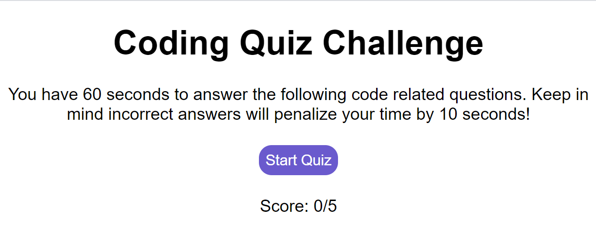

# Week04-CodeQuiz

A timed JavaScript code quiz to test your knowledge, that keeps track of your scores.

## Expected Behavior

* Quiz and timer begins when the start button is clicked

* Questions are presented one at a time

* When an incorrect answer is given, there is a 10 second penalty

* Quiz is over when all questions are answered OR time expires

* When quiz is completed, score and initials are saved

## Link to deployed application

[GitHub](https://fett-boba.github.io/Week03-PasswordGenerator/) https://fett-boba.github.io/Week03-PasswordGenerator/

## Assets

---